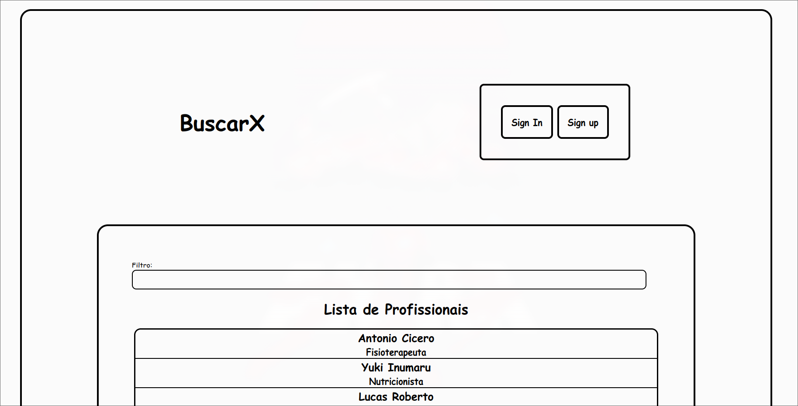
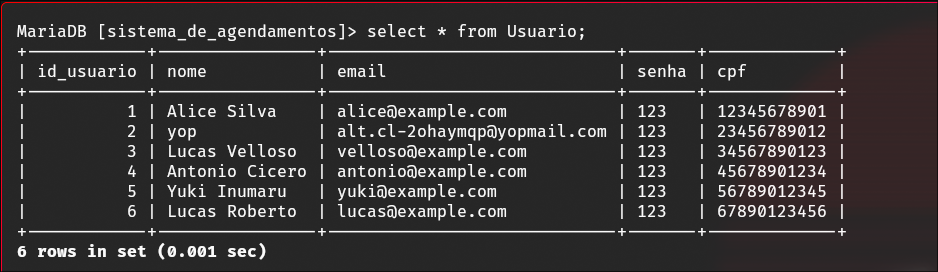

# Busca X - Sistema de agendamento de Consultas

### Software Stack
- Java 22
- Maven 3.9.2
- Tomcat9
- Mariadb
- jsp/css/js
- MVC

### Básico do Sistema
O usuário pode ser um profissional ou um cliente e a função básica é fazer agendamento
de consultas entre um profissional e um cliente, o usuário tem autonomia em criar,
atualizar, deletar seu perfil, além disso recebe um email informado o link para
a realização da vídeo chamada. Nosso sistema não esta disponível para o WWW.

### Modo de uso no localhost
- Executar o servidor do tomcat9/servlet em loopback `$ catalina.sh run`.
- Executar o banco de dados (Mariadb/MySQL) com o login: `root` e a senha: `root`.
- Criar e popular o banco de dados com os seguintes comandos dentro do shell do.
Mariadb/MySQL `source db/create.sql` e `source db/populate.db`.
- Dessa forma será criado um banco de dados com o nome de `sistema_de_agendamentos`.
- Com 6 linhas de usuários: as 3 primeiras linhas sao clientes e as 3 ultimas são
de profissionais.
- E além disso 3 agendamentos.

- Após isso pode-se fazer o comando para dar o deploy da aplicação com o wrapper
do maven usando o comando `./mvnw tomcat7:redeploy`.
- E por sua vez a pagina `http://localhost:8080/AgendarConsultas/` estará disponível
na sua maquina para o uso do sistema como podemos ver na imagem do inicio.

### R1:
##### Status Implementação
- [ ] Implementado 
- [x] Parcialmente implementado 
- [ ] Não implementado
Obs: Cliente tem autonomia no seu CRUD e não o Admin.
##### Divisão na implementação da funcionalidade: 
Antônio Cícero, Lucas Velloso e Vitor Yuki.

### R2:
##### Status Implementação
- [ ] Implementado 
- [x] Parcialmente implementado 
- [ ] Não implementado
Obs: Profissional tem autonomia no seu CRUD e não o Admin.
##### Divisão na implementação da funcionalidade: 
Antônio Cícero, Lucas Velloso e Vitor Yuki.

### R3:
##### Status Implementação
- [x] Implementado 
- [ ] Parcialmente implementado 
- [ ] Não implementado
##### Divisão na implementação da funcionalidade: 
Antônio Cícero, Lucas Roberto.

### R4:
##### Status Implementação
- [x] Implementado 
- [ ] Parcialmente implementado 
- [ ] Não implementado
##### Divisão na implementação da funcionalidade: 
Antônio Cícero, Vitor Yuki.

### R5:
##### Status Implementação
- [x] Implementado 
- [ ] Parcialmente implementado 
- [ ] Não implementado
##### Divisão na implementação da funcionalidade: 
Antônio Cícero, Lucas Velloso, Lucas Roberto.

### R6:
##### Status Implementação
- [x] Implementado 
- [ ] Parcialmente implementado 
- [ ] Não implementado
##### Divisão na implementação da funcionalidade: 
Antônio Cícero, Lucas Velloso, Lucas Roberto, Vitor Yuki.

### R7:
##### Status Implementação
- [x] Implementado 
- [ ] Parcialmente implementado 
- [ ] Não implementado
##### Divisão na implementação da funcionalidade: 
Antônio Cícero, Lucas Velloso, Lucas Roberto, Vitor Yuki.

### R7:
##### Status Implementação
- [x] Implementado 
- [ ] Parcialmente implementado 
- [ ] Não implementado
##### Divisão na implementação da funcionalidade: 
Antônio Cícero, Vitor Yuki.

#### Obs: 
Não Conseguimos fazer o upload de arquivo dessa forma apenas o nome do arquivo
é guardado no nosso banco de dados.
